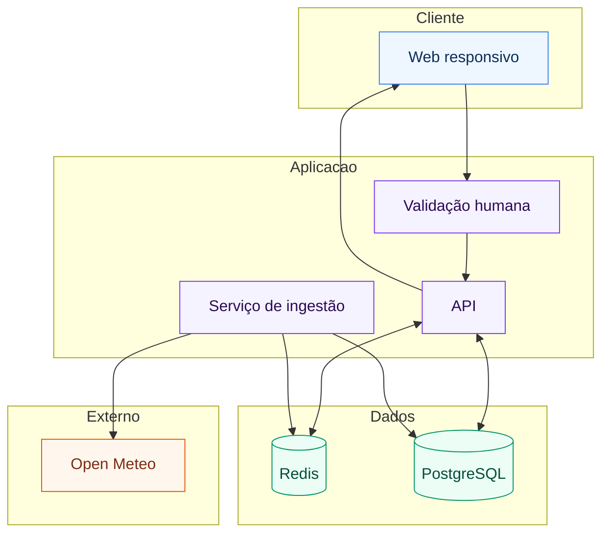
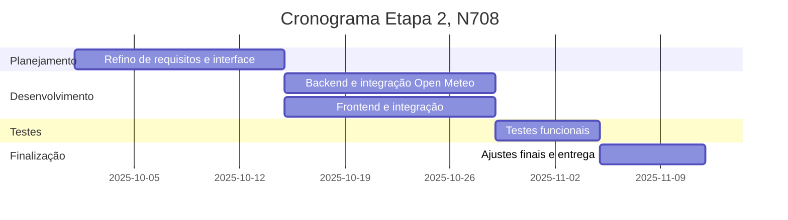

# Será que chove?

Aplicação Web responsiva que fornece previsões de chuva por bairro em Fortaleza.  
O sistema apresenta respostas textuais simples para três janelas de tempo, 6h, 12h e 24h, reforçadas com cores que indicam o nível de probabilidade.

##  Objetivo
Entregar uma solução acessível para consulta de previsão de chuvas por bairro, em linguagem clara e visual minimalista, com foco em texto.

##  Problema e justificativa
Chuvas intensas em Fortaleza geram transtornos à mobilidade e ao cotidiano. Cidadãos precisam de informações locais, simples e rápidas, sem necessidade de gráficos, para planejar deslocamentos e atividades.

##  Escopo
- Consulta de previsão por bairro a partir de lista oficial.
- Exibição textual das janelas de 6h, 12h e 24h.
- Reforço visual por cor conforme probabilidade.
- Validação humana leve antes do processamento.

##  Arquitetura
- Cliente, Web responsivo, interface textual, cores por nível de risco.
- Validação humana, captcha na entrada do backend.
- API, Node.js e Express, entrega previsões em texto.
- Serviço de ingestão, coleta periódica na Open Meteo, normalização e gravação.
- Cache, Redis, TTL adaptativo entre 15 e 120 minutos.
- Banco de dados, PostgreSQL, bairros com centróide, séries horárias, diárias, snapshots.
- Integração externa, Open Meteo Forecast API.

###  Diagrama de arquitetura

##  Dados
- **Bairro**: id, nome, latitude, longitude, centróide.  
- **Previsão horária**: probabilidade de precipitação, milímetros de chuva, código WMO, hora local.  
- **Previsão diária**: precipitação acumulada, horas de precipitação, probabilidade máxima, dia local.  
- **Snapshot**: perfil climático, TTL em minutos, horários de atualização.  

##  Regras de apresentação
- Três blocos textuais, 6h, 12h e 24h.  
- Linguagem natural por faixas de probabilidade:  
  - 0 a 19 → provavelmente não chove  
  - 20 a 39 → pouca chance de chuva  
  - 40 a 59 → pode chover  
  - 60 a 79 → provavelmente chove  
  - 80 a 100 → muito provavelmente chove  
- Quatro cores de fundo:  
  - 0 a 19 → verde claro  
  - 20 a 39 → azul claro  
  - 40 a 79 → amarelo claro  
  - 80 a 100 → laranja claro  
- Carimbo de atualização e indicação da próxima atualização.  

##  Tecnologias
- **Frontend**: Web responsivo.  
- **Backend**: Node.js e Express.  
- **Banco de dados**: PostgreSQL.  
- **Cache**: Redis.  
- **Clima**: Open Meteo Forecast API.  

##  Cronograma, etapa 2 N708
- **Semana 1 e 2**: refino de requisitos e interface.  
- **Semana 3 e 4**: backend e integração com Open Meteo + frontend e integração.  
- **Semana 5**: testes funcionais.  
- **Semana 6**: ajustes finais e entrega.  

##  Equipe
- Integrante 1, função.  
- Integrante 2, função.  
- Integrante 3, função.  
- Integrante 4, função.  

##  Contexto acadêmico
Projeto do curso de **Análise e Desenvolvimento de Sistemas da Unifor**, disciplina **N705 – Projeto Aplicado Multiplataforma, etapa 1**.

