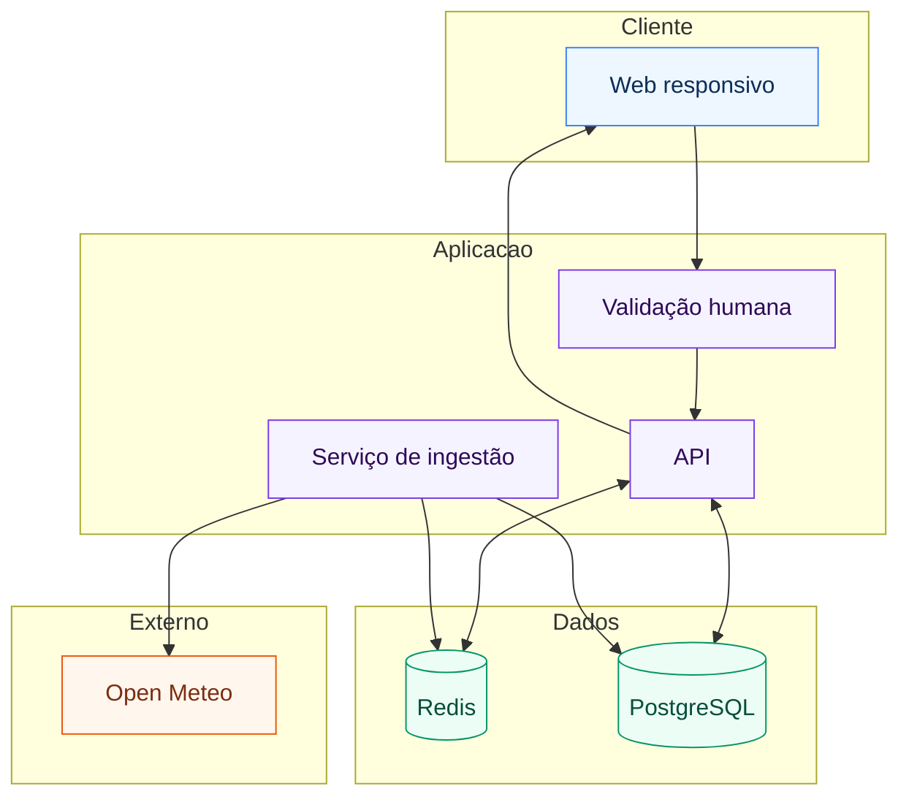

#  Arquitetura do Sistema, Será que chove

## 1. Descrição da arquitetura
A solução é composta por um cliente Web responsivo, um backend com API de aplicação e um serviço de ingestão. A API expõe previsões já consolidadas em texto. A ingestão consulta periodicamente a Open Meteo, normaliza dados e persiste no banco. Um cache em Redis acelera respostas por bairro e janela de tempo, com TTL adaptativo. A verificação humana ocorre antes do processamento da API. O banco utiliza apenas centróides dos bairros, sem uso de extensões geoespaciais.

## 2. Componentes do sistema
| Componente | Responsabilidades principais | Entradas | Saídas |
|---|---|---|---|
| Web responsivo | Busca por bairro, renderização textual de 6h, 12h e 24h, cores por nível | bairro_id, resposta da API | páginas em texto com probabilidade e faixas |
| Validação humana | Bloqueio de abuso, comprovação de humano | token do captcha | autorização para a API continuar |
| API de aplicação | Agregação de dados, formatação de texto humano, seleção de cor, gestão de cache | bairro_id, Redis, PostgreSQL | texto pronto por janela, JSON opcional |
| Serviço de ingestão | Coleta periódica na Open Meteo, normalização, atualização de snapshots e cache | Open Meteo, catálogo de bairros | séries horárias e diárias, cache atualizado |
| Redis | Cache quente por bairro e janela, TTL adaptativo | blocos textuais, séries horárias | respostas rápidas, redução de latência |
| PostgreSQL | Persistência confiável, centróides de bairros, séries horárias e diárias, snapshot operacional | registros de ingestão | base de dados para API e análises |

## 3. Padrões arquiteturais utilizados
- API REST, endpoints simples e idempotentes para consulta por bairro.  
- Cache aside, leitura primeiro no Redis, em falta, preenche cache após calcular.  
- Scheduler, ingestão periódica independente do tráfego do usuário.  
- Retry com backoff e limiares de erro, chamadas à Open Meteo com tolerância a falhas.  
- Fail soft, em indisponibilidade externa, exibir último dado válido em cache com aviso.  
- Doze fatores, configuração por variáveis de ambiente, logs sequenciais, estateless na API.  
- Observabilidade mínima, logs de requisição, métricas de latência, acerto de cache e idade de dados.

## 4. Diagrama de arquitetura

## 5. Decisões técnicas e justificativas

| Decisão                                | Opções consideradas                      | Justificativa                                                                              | Impacto                                                     |
| -------------------------------------- | ---------------------------------------- | ------------------------------------------------------------------------------------------ | ----------------------------------------------------------- |
| Centróide de bairro em vez de polígono | PostGIS com polígonos, centróide simples | reduz complexidade, atende ao requisito de previsão por bairro, facilita ETL               | menor custo de modelagem, evolução futura possível          |
| Cache em Redis com TTL adaptativo      | sem cache, cache fixo                    | melhora latência, reduz chamadas externas, ajusta frescor conforme instabilidade climática | respostas mais rápidas, menor custo de integração           |
| Verificação humana antes da API        | sem verificação, verificação após lógica | protege recursos do backend, evita processamento desnecessário                             | menor risco de abuso, custo mínimo de fricção               |
| API REST minimalista                   | RPC específico, GraphQL                  | simplicidade, fácil manutenção, aderência ao escopo                                        | menor curva de aprendizado, documentação direta             |
| Serviço de ingestão agendado           | somente on demand, streaming contínuo    | garante dados prontos em horários comuns, diminui picos de latência                        | previsões mais rápidas, controle operacional claro          |
| Texto humano sem gráficos              | gráficos e mapas, interfaces ricas       | foco em acessibilidade, rapidez de leitura e baixo atrito                                  | experiência simples, compatível com dispositivos diversos   |
| Integração exclusiva com Open Meteo    | múltiplos providers, agregador           | consistência de dados, simplicidade de contrato, custo zero                                | menor complexidade, risco de dependência mitigado por cache |
