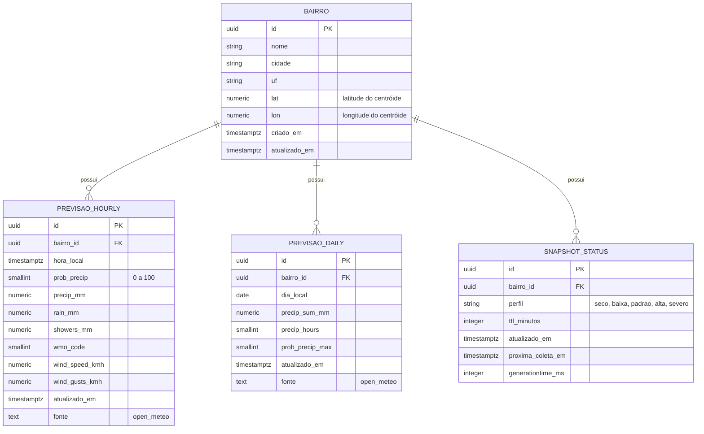

# 🗄️ Banco de Dados

## 1. Modelo de dados
O sistema armazena:
- Catálogo oficial de bairros com centróide geográfico, latitude e longitude.
- Séries horárias de previsão, base para compor janelas de 6h, 12h e 24h.
- Agregados diários de previsão.
- Snapshot operacional por bairro, perfil climático e TTL adaptativo.

Entidades principais: **bairro**, **previsao_hourly**, **previsao_daily**, **snapshot_status**.

## 2. Descrição das entidades e relacionamentos
- **bairro** possui muitas **previsao_hourly**, relacionamento 1 para N.
- **bairro** possui muitos **previsao_daily**, relacionamento 1 para N.
- **bairro** possui muitos **snapshot_status**, relacionamento 1 para N, guardando estados ao longo do tempo.
- Todas as entidades de previsão fazem referência a **bairro** por **bairro_id**.

## 3. Diagrama ER

## 4.  Dicionário de dados

### 4.1 Tabela **bairro**
| Campo | Tipo | Obrigatório | Regra e exemplo | Descrição |
|-------|------|-------------|-----------------|-----------|
| id | UUID | Sim | PK | Identificador do bairro |
| nome | varchar(120) | Sim | Único por cidade | Nome oficial do bairro |
| cidade | varchar(120) | Sim | Ex: Fortaleza | Município |
| uf | char(2) | Sim | Ex: CE | Unidade federativa |
| lat | numeric(9,6) | Sim | Ex: -3.732710 | Latitude do centróide WGS84 |
| lon | numeric(9,6) | Sim | Ex: -38.526669 | Longitude do centróide WGS84 |
| criado_em | timestamptz | Sim | Default agora | Data de criação |
| atualizado_em | timestamptz | Sim | Default agora | Última atualização |

---

### 4.2 Tabela **previsao_hourly**
| Campo | Tipo | Obrigatório | Regra e exemplo | Descrição |
|-------|------|-------------|-----------------|-----------|
| id | UUID | Sim | PK | Identificador do registro |
| bairro_id | UUID | Sim | FK bairro(id) | Referência ao bairro |
| hora_local | timestamptz | Sim | Carimbo local | Hora da previsão válida |
| prob_precip | smallint | Não | 0 a 100 | Probabilidade de precipitação |
| precip_mm | numeric(6,2) | Não | Ex: 4,50 | Precipitação total hora |
| rain_mm | numeric(6,2) | Não | Ex: 3,20 | Chuva estratiforme hora |
| showers_mm | numeric(6,2) | Não | Ex: 1,30 | Pancadas convectivas hora |
| wmo_code | smallint | Não | Catálogo WMO | Código de tempo |
| wind_speed_kmh | numeric(5,1) | Não | Ex: 18,5 | Velocidade do vento |
| wind_gusts_kmh | numeric(5,1) | Não | Ex: 34,0 | Rajadas |
| atualizado_em | timestamptz | Sim | Default agora | Data de atualização |
| fonte | text | Sim | Ex: open_meteo | Provedor da previsão |

---

### 4.3 Tabela **previsao_daily**
| Campo | Tipo | Obrigatório | Regra e exemplo | Descrição |
|-------|------|-------------|-----------------|-----------|
| id | UUID | Sim | PK | Identificador do registro |
| bairro_id | UUID | Sim | FK bairro(id) | Referência ao bairro |
| dia_local | date | Sim | AAAA-MM-DD | Dia da previsão |
| precip_sum_mm | numeric(7,2) | Não | Ex: 22,75 | Precipitação no dia |
| precip_hours | smallint | Não | 0 a 24 | Horas com precipitação |
| prob_precip_max | smallint | Não | 0 a 100 | Probabilidade máxima no dia |
| atualizado_em | timestamptz | Sim | Default agora | Data de atualização |
| fonte | text | Sim | Ex: open_meteo | Provedor da previsão |

---

### 4.4 Tabela **snapshot_status**
| Campo | Tipo | Obrigatório | Regra e exemplo | Descrição |
|-------|------|-------------|-----------------|-----------|
| id | UUID | Sim | PK | Identificador |
| bairro_id | UUID | Sim | FK bairro(id) | Referência ao bairro |
| perfil | varchar(20) | Sim | seco, baixa, padrao, alta, severo | Perfil climático atual |
| ttl_minutos | int | Sim | 15 a 120 | TTL sugerido para cache |
| atualizado_em | timestamptz | Sim | Carimbo | Quando o snapshot foi atualizado |
| proxima_coleta_em | timestamptz | Sim | Carimbo | Próxima coleta planejada |
| generationtime_ms | int | Não | Ex: 320 | Tempo de geração da previsão pelo provedor |

---

## 5. 📝 Notas de modelagem
- O sistema não utiliza PostGIS, apenas **lat/lon** do centróide para consultas à Open Meteo.  
- As janelas de **6h, 12h e 24h** são derivadas de **previsao_hourly**, agregando a probabilidade máxima por janela.  
- A tabela **previsao_daily** dá suporte a relatórios e validações de consistência.  
- A tabela **snapshot_status** direciona a política de **TTL adaptativo** do cache.  
- Particionamento por data é recomendado em **previsao_hourly** quando o volume de registros aumentar.  
