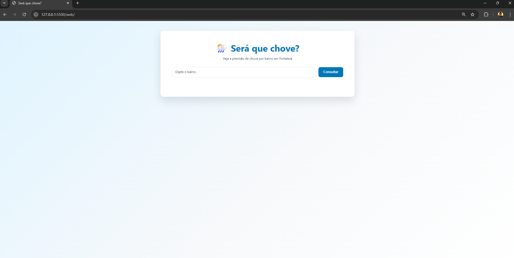
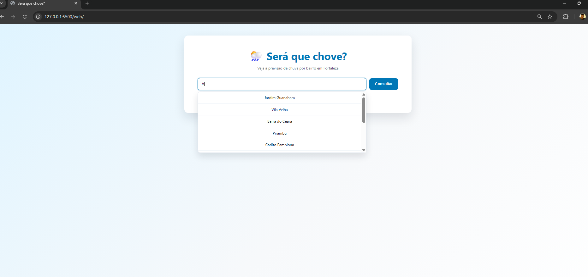
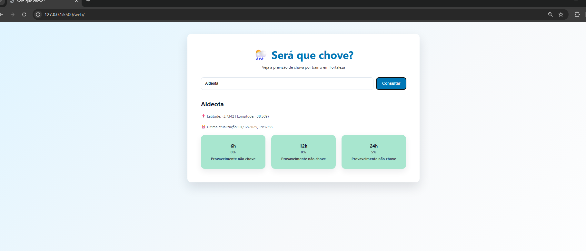
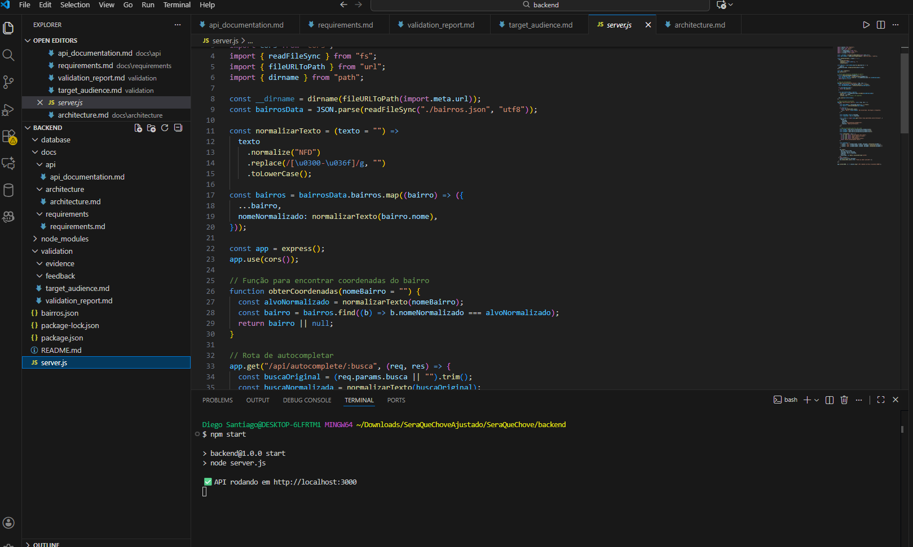
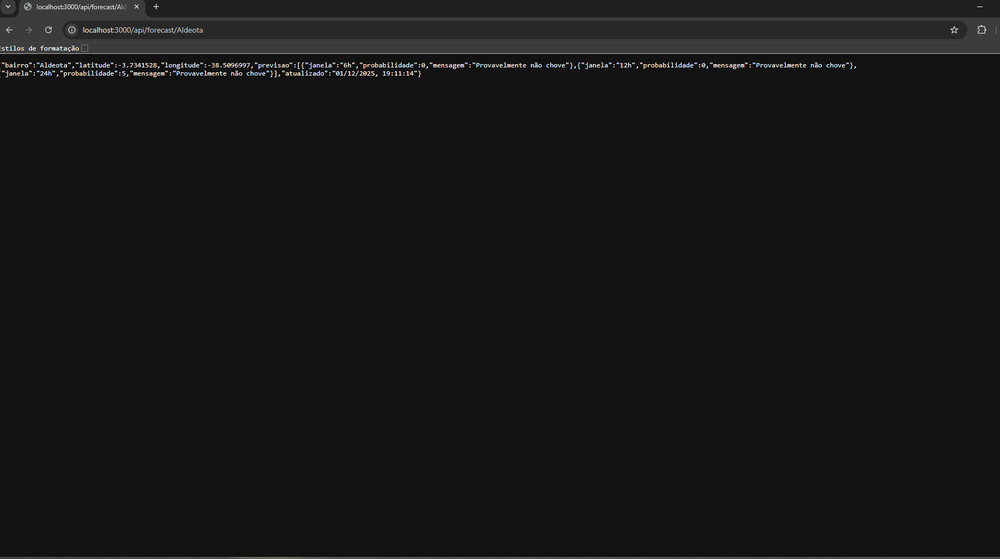

# 📸 Evidências de Funcionamento do Sistema

As imagens abaixo comprovam o funcionamento completo da aplicação **“Será que Chove?”**, desde a execução do backend até a exibição dos resultados no frontend.

---

## ⚙️ Backend rodando

---

## 🌐 API no navegador

---

## 🖥️ Tela inicial da aplicação

---

## 🔍 Teste de pesquisa

---

## 🌦️ Resultado da previsão

---

📍 **Autores:**  
- Diego Ferreira Santiago  
- Emerson Leonardo de Lima Pinto  
- Geovani Alves Saraiva  
- Vitor Alexandre Melo Costa  
- Fabrício Silva dos Santos  

📍 **Disciplina:** Projeto Aplicado Multiplataforma – Etapa 2 (N708)
